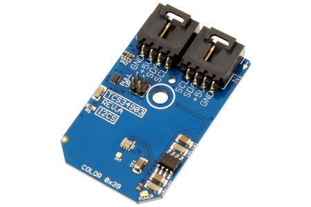

[](https://www.controleverything.com/content/Color?sku=TCS34903FN_I2CS)
# TCS34903
TCS34903 Color Light-to-Digital Converter  

The TCS34903 provides color and IR (red, green, blue, clear and IR) light sensing using I²C communications.

This Device is available from ControlEverything.com [SKU: TCS34903FN_I2CS]

https://www.controleverything.com/content/Color?sku=TCS34903FN_I2CS

This Sample code can be used with Raspberry pi.

##Java 
Download and install pi4j library on Raspberry pi. Steps to install pi4j are provided at:

http://pi4j.com/install.html

Download (or git pull) the code in pi.

Compile the java program.
```cpp
$> pi4j TCS34903.java
```

Run the java program as.
```cpp
$> pi4j TCS34903
```

##Python 
Download and install smbus library on Raspberry pi. Steps to install smbus are provided at:

https://pypi.python.org/pypi/smbus-cffi/0.5.1

Download (or git pull) the code in pi. Run the program

```cpp
$> python TCS34903.py
```

The code output is the lux value of IR , RGB  and total luminance.

